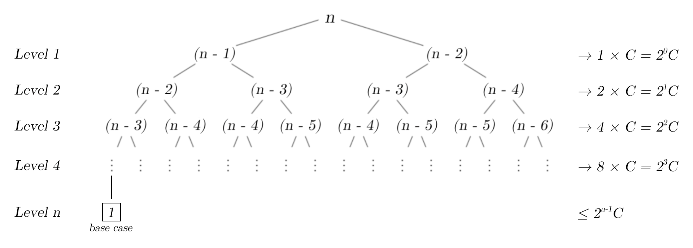
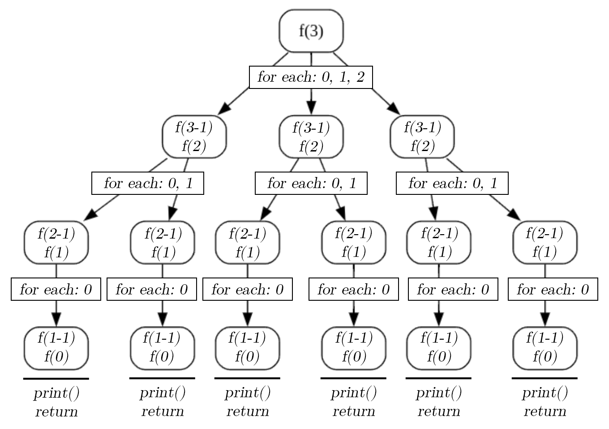

# Introduction to Big-O Notation

Welcome in this introduction to Big-O Notation. I decided to write it to better understand this algorithms analysis method, motivated by the desire to prepare myself for Big Tech coding interviews.

## Table of contents

1. Overview
	1. Definition
	2. Types of measurement
	3. General rules
	4. Why it's useful
	5. Choose the right algorithm
2. Complexities
	1. $O(1)$ - Constant Time
	2. $O(log \space n)$ - Logarithmic Time
	3. $O(n)$ - Linear Time
	4. $O(n \space log \space n)$ - Linearithmic Time
	5. $O(n^2)$ - Quadratic Time
	6. $O(2^n)$ - Exponential Time
	7. $O(n!)$ - Factorial Time
3. Big-O Gotchas
4. Space Complexity
5. Sources & References

## I - Overview

### 1. Definition

**Big-O Notation** is a mathematical way to describe how the runtime (or space requirement) of an algorithm grows as the size of the input increases. It focuses on the worst-case scenario and provides an upper bound on the growth rate.

It measures algorithm's efficiency based on four principles:

1. **Complexity in terms of input size ($n$):** abstract the efficiency of algorithms from the machines they run on.
2. **Machine independent:** don't care about the stats of the machine.
3. **Basic computer steps:** only examine the basic computer steps of the code.
4. **Time and space:** analyze time and space.

### 2. Types of measurement

There are three different ways to estimate the efficiency of an algorithm:

1. **Worst Case Analysis (Mostly used):**
	- In the worst-case analysis, we calculate the upper bound on the running time of an algorithm. We must know the case that causes a maximum number of operations to be executed.
	- This is the most commonly used analysis of algorithms, most of the time we consider the case that causes maximum operations.
	- The Big-O Notation is based on it.
2. **Best Case Analysis (Very Rarely used):**
	- In the best-case analysis, we calculate the lower bound on the running time of an algorithm. We must know the case that causes a minimum number of operations to be executed.
3. **Average Case Analysis (Rarely used):**
	- In average case analysis, we take all possible inputs and calculate the computing time for all of the inputs. Sum all the calculated values and divide the sum by the total number of inputs.
	- We must know (or predict) the distribution of cases.

### 3. General rules

1. **Ignore constants:** for example, consider a code with 5 statements, each with a complexity of $O(n)$, its real compexity is $5 \times O(n)$ so $5n$, but since we ignore constants, its Big-O Notation will be $O(n)$. Why? Because as a function's input moves towards the infinity, constants become less and less significant.
2. **Certain terms dominate others:** it is called *"Big-O Growth Rate"* or *"Big-O Growth Hierarchy"*. Big-O Notation ignore low-oder terms so the following rule can be deduced:

$$O(1) < O(log \space n) < O(n) < O(n \space log \space n) < O(n^2) < O(2^n) < O(n!)$$

Here is a graphic representation to better understand this concept:

<div align="center">


</div>

### 4. Why it's useful

Let's take a practical example. David and Goliath are two software engineers and they need an algorithm to search a number in a sorted list of $n$ elements. David suggest a binary search and Goliath a linear search. To make the right choice, they decide to determine and understand the complexity of each algorithm.

In the first one, we divide the list into two halves, determine which half the target is in, and repeat this process until the target is found or the list is empty. In the best case, this method has a complexity of $O(1)$ if the target is at the middle, and in the worst case, its complexity is $O(log \space n)$ because each step halves the search space.

In the second algorithm, we check each element one by one until the target is found or the list ends. In the best case, the complexity is also $O(1)$ if the target is the first element. But in the worst case, if the target is the last element or not in the list, the complexity becomes $O(n)$.

So for a list of 1,000,000 elements, in the worst case, the linear search algorithm might take up to 1,000,000 comparisons ($O(n)$ complexity) whereas the binary search will take $log_2(1,000,000) \approx 20$ comparisons ($O(log \space n)$ complexity). So in this case, the binary search algorithm fits perfectly!

As you can notice, this is a very trivial example but the essence of the Big-O Notation utility is here. By the way, here, we just take care of the size of the input (the data) but in practice, there are a lot of others elements to take in account to determine which algorithm to use.

### 5. Choose the right algorithm

As we saw in the previous part, make the good choice when selecting an algorithm is crucial and depends on more elements than just the input size. So in this part we'll detail the approach and the elements to take in account to correclty choose an algorithm.

**1. Understand your problem's requirements**

The first step is to understand and review your problem's requirements:

- **What kind of problem are you solving?**
	- **Sorting:** do you need to sort a list of items?
	- **Searching:** are you trying to find specific items in a dataset?
	- **Optimization:** are you looking to optimize something, like the shortest path in a graph or maximizing/minimizing some function?
	- **Data processing:** are you transforming, aggregating, or cleaning data?
- **What are the constraints of your problem?**
	- **Real-time requirements:** does the algorithm need to work within strict time limits?
	- **Data size:** are you dealing with a small dataset, or does the dataset scale to millions or billions of items?
	- **Space/memory limitations:** how much memory can you afford to use?
	- **Accuracy:** does the algorithm need to be exact, or is an approximation acceptable?

**2. Analyze the data characteristics**

As we saw before, to make the right algorithm choice, we need to take care of the data:

- **Size of the data:** the larger the data, the more important time complexity becomes.
- **Data structure:** what is the format of the data? Is it a list, array, graph, tree, or something else? Some algorithms work better on specific data structures. 
- **Sorted vs. unsorted:** if the data is already sorted, certain algorithms (like binary search) may perform much better than others.
- **Fixed vs. dynamic data:** will the data change frequently (like adding/deleting items), or is it static?

**3. Match the problem with the right algorithm**

Based on the problem and data characteristics, here's how you might choose the algorithm:

**Example 1: Sorting**

- **Problem:** you need to sort a list of integers.
- **Data:** the list is large (millions of integers).
- **Algorithm Choices:**
	- **Merge Sort or QuickSort (**$O(n \space log \space n)$**):** these are efficient sorting algorithms for large datasets. They will scale better than simpler sorts (like Bubble Sort).
	- **Bubble Sort (**$O(n²)$**):** works well for small datasets but becomes inefficient as data grows.

**Conclusion:** Merge Sort or QuickSort is the best choice for large datasets. If the list is small, Bubble Sort could suffice, but it’s generally less efficient.

**Example 2: Searching**

- **Problem:** you need to find whether a number exists in a list of integers.
- **Data:** the list is unsorted and contains millions of elements.
- **Algorithm Choices:**
	- **Linear Search (**$O(n)$**):** this is a simple algorithm that will scan through each element in the list.
	- **Binary Search (**$O(log \space n)$**):** if the list were sorted, Binary Search would be much faster.

**Conclusion:** Linear Search is the right choice if the data is unsorted. If sorting the list is an option, Binary Search would be far more efficient for future searches.

## II - Complexities

### 1. $O(1)$ - Constant Time

$O(1)$ (constant time) complexity describes an algorithm whose execution time or space requirements remain constant regardless of the input size. This means that the algorithm performs the same number of operations, regardless of whether the input size is 1, 100, or 1 million.

**Characteristics:**

- **Independent from input size ($n$):** the number of steps the algorithm takes does not grow with the size of the input.
- **Efficient:** algorithms with $O(1)$ complexity are typically very fast because they perform a fixed number of operations.
- **Examples:**
	- Expressions that never change (e.g., $100 \times 100000$).
	- Accessing an element in an array by its index (e.g., `arr[5]`).
	- Inserting an element into a hash table (on average).
	- Checking the length of a list (if it is pre-computed)

**Example:**

```Python
def oneFunc():
	x = 5 + (15 * 20) # O(1)
	y = 15 - 2 # O(1)
	print(x + y) # O(1)
```

In this example, each line of this code has a complexity of $O(1)$ so the complexity of the code is:

$$O(1) + O(1) + O(1) = O(1)$$

$$OR$$

$$3 \times O(1) = O(1)$$

We categorize a function to $O(1)$ if and only if all the steps have a complexity of $O(1)$.

### 2. $O(log \space n)$ - Logarithmic Time

$O(log \space n)$ (logarithmic time) complexity describes an algorithm where the execution time grows logarithmically with the size of the input. This means that as the input size increases, the number of operations grows much more slowly, proportional to the logarithm of the input size.

**Characteristics:**

- **Logarithmic Growth:** for each doubling of the input size, the number of operations increases by a fixed, smaller amount.
- **Efficient for Large Inputs:** algorithms with $O(log \space n)$ complexity are very efficient for processing large inputs because the work grows slowly.
- **Common in Divide-and-Conquer:** algorithms that repeatedly divide the input into smaller parts often have $O(log \space n)$ complexity.
- **Examples:**
	- **Binary Search:** searching for a value in a sorted array by repeatedly halving the search space.
	- **Tree Traversals:** operations on balanced binary search trees (e.g., insert, delete, or search).

**Logarithms:**

Before going further, we need to understand what a logarithm is. Simply, it's the power that a number needs to be raised to get some other number. In computer science, unless specified otherwise, the number that we want to raise to some power is always 2 (binary systems). This is the theory, now let's see that more in details thanks to an example.

Considering this expression: $2^x = 8$, we want to find the number to which we must raise 2 to find 8. This expression is the equivalent to: $x = log_2(8) = 3$ so $2^3 = 8$. Here it is, this is the basics of logarithms. Now, we can see codes examples.

**Example (recursive):**

```Python
def logFunc(n):
	if n == 0: # O(1)
		return # O(1)
	n = math.floor(n / 2) # O(1)
	return logFunc(n) # O(log n)
```

This example is a simple recursive function that repeatedly divides the input `n` by 2 (using `Math.floor()` to ensure the result is an integer) until `n` reaches 0.

Here is a diagram to schematize its operation with `n = 8`:

<div align="center">


</div>

> Note: we skip the last recursive call with $n = 0$ to make it easier to understand.

So, in this example where `n` equals to ${\color{green}8}$ we can see that there is ${\color{lightblue}3}$ levels of execution and in each level we divide `n` by ${\color{red}2}$, corresponding to $2^{\color{lightblue}3} = {\color{red}2} \times {\color{red}2} \times {\color{red}2} = {\color{green}8}$.

**Example (iterative):**

```Python
def logFunc(n):
	while (n > 1): # O(log n)
		n = math.floor(n / 2) # O(1)
```

In this iterative example, the `logFunc()` function repeatedly divides `n` by 2 using a while loop until `n` becomes less than or equal to 1.

Here is a breakdown:

```Text
Iteration 1: n = 8 / 2 = 4
Iteration 2: n = 4 / 2 = 2
Iteration 3: n = 2 / 2 = 1
```

So when we pass in a value of `n`, we'll always need to divide this value `n` by $2(log \space n)$ times to get 1 or we need to do $log \space n$ iterations of the loop before we get 1, so:

$$O(log \space 8) \rightarrow O(log_2 \space 8) = 3 \rightarrow 2^3 = 8$$

### 3. $O(n)$ - Linear Time

$O(n)$ (linear time) complexity describes an algorithm where the execution time grows linearly with the size of the input. This means that as the input size doubles, the number of operations also doubles.

**Characteristics:**

- **Proportional Growth:** the time taken or operations performed are directly proportional to the input size.
- **Common in Iterative Processes:** algorithms that process every element in the input once, typically exhibit $O(n)$ complexity.
- **Scales Well with Moderate Input Sizes:** while it may not be as fast as $O(1)$ or $O(log \space n)$, linear time algorithms are efficient for many use cases.
- **Examples:**
	- **Iterating through an Array:** visiting every element in an array to calculate the sum or find a specific value.
	- **Linear Search:** searching for a value in an unsorted array by examining each element.

**Example:**

```Python
def nFunc(n):
	y = 5 + (15 * 20) # O(1)
	for x in range(0, n): # O(n)
		print(x) # O(1)
```

Here is a simple example with 2 statements. The first statement is a calculation which does not depend on any index so its have a $O(1)$ complexity. The second statement is a simple `for()` loop iterates from 0 to `n` and prints the value of `x`, so the complexity of this statement will be:

$$O(n) \times O(1) = O(n)$$

And as we saw earlier, and according to the *"Big-O Notation Growth Rate"*, the statements with a $O(n)$ complexity dominate the statements with a $O(1)$ complexity, so this code has a complexity of $O(n)$.

### 4. $O(n \space log \space n)$ - Linearithmic Time

$O(n \space log \space n)$ (linearithmic time) complexity describes an algorithm where the execution time grows proportionally to the input size $n$, multiplied by the logarithm of $n$. This type of complexity often arises in algorithms that combine linear iteration with a divide-and-conquer approach or efficient sorting mechanisms.

**Characteristics:**

- **Combination of Linear and Logarithmic Work:** the $n$ factor comes from processing all elements, and the $log \space n$ factor arises from repeatedly dividing the problem or performing logarithmic work for each element.
- **Efficient for Large Data Sets:** many optimal sorting algorithms, like Merge Sort and Quick Sort, operate with $O(n \space log \space n)$ complexity.
- **Examples:**
	- **Merge Sort:** divides the array into halves ($log \space n$) and merges them back together in linear time ($n$).
	- **Heap Sort:** builds a binary heap ($O(n)$ complexity) and performs repeated heap extractions ($O(log \space n)$ complexity).

**Example:**

```Python
def nLogNFunc(n):
	y = n # O(1)
	while (n > 1): # O(log n)
		n = math.floor(n / 2) # O(1)
		for i in range(1, y + 1): # O(n)
			print(i) # O(1)
```

In this example, the `nLogNFunc()` function takes an integer $n$ as input and performs two main operations in a loop. It first initializes a variable $y$ to $n$ and enters a `while()` loop that continues as long as $n$ is greater than 1. In each iteration of the `while()` loop, $n$ is halved (using integer division), and a `for()` loop runs $y$ times (where $y$ is initially equal to $n$), printing the numbers from 1 to $y$. Since $n$ is halved in each iteration of the `while()` loop, the number of iterations of the `while()` loop is approximately $log2(n)$, and the inner `for()` loop runs $n$ times in the first iteration, $n/2$ times in the second, and so on, resulting in a total time complexity of $O(n \space log \space n)$.

Here is a scheme to better understand:

<div align="center">


</div>

> Note: the brackets that enclose the printing statements designate
the `for()` loop ($O(n)$ complexity) and not the `print()` statements ($O(1)$ complexity).

For each iteration in the `while()` loop, we loop to the full size of $y$, which is the original size of $n$, so each of these inner loops has a complexity of $O(n)$, so the processing time increases linearly with the size of $n$.

Example with an input ($n$) of ${\color{lightblue}4}$: $O(log_{\color{red}2} \space {\color{lightblue}4}) = {\color{green}2}$ because ${\color{red}2}^{\color{green}2} = {\color{lightblue}4}$

Time to bring everything together, $O(n \space log \space n)$ means $O(n \times log \space n)$ so if we insert some values we get: 

$$O({\color{lightblue}4} \times {\color{green}2}) \space because \space log_2({\color{lightblue}4}) = {\color{green}2}$$
  
And if you look to the visualization, it makes sense because for each iteration of the `while()` loop, we iterate trough the entirety of $y$, which is the original value of $n$.

### 5. $O(n^2)$ - Quadratic Time

$O(n^2)$ (quadratic time) complexity describes an algorithm where the execution time grows proportionally to the square of the input size. This means that as the input size $n$ doubles, the number of operations increases by a factor of $4 \space (2^2)$.

**Characteristics:**

- **Rapid Growth:** the time taken grows quickly as the input size increases, making $O(n^2)$ less efficient for large inputs.
- **Nested Loops:** algorithms with $O(n^2)$ complexity often involve two nested loops, each iterating through the input.
- **Good for Small Data Sets:** while slow for large inputs, $O(n^2)$ can be acceptable for small or moderately sized inputs.
- **Examples:**
	- **Bubble Sort:** compares adjacent elements in a list and swaps them if needed, requiring nested iterations over the input.
	- **Checking All Pairs:** comparing every possible pair of elements in an array or matrix.

**Example:**

```Python
def square(n):
	for i in range(0, n): # O(n)
		for j in range(0, n): # O(n)
			print(i, j) # O(1)
```

In this example, the `square()` function generates and prints all possible pairs of integers $(i,j)$ where both $i$ and $j$ range from $0$ to $n−1$. It uses two nested loops: the outer loop iterates over $i$ from $0$ to $n−1$, and for each value of $i$, the inner loop iterates over $j$ in the same range. This results in $n^2$ outputs, corresponding to all combinations of $i$ and $j$ within the specified range, effectively creating a two-dimensional matrix.

As usual, here is a scheme to better understand:

<div align="center">


</div>

For $n = 4$ we create a matrix with an area of $i \times j = 4 \times 4 = 4^2 = 16$, which will be equal to the number of cells in the matrix and also happends to be the number of times that the code will execute the `print()` statement. So the real complexity of the function is $O(4^2)$ so $O(n^2)$.

We can also deduce this from the fact that there are two nested `for()` loops, each with a complexity of $O(n)$, so $O(n) \times O(n) = O(n^2)$. That's why, tipically, functions with nested `for()` loops have a $O(n^2)$ complexity.

> Note: the principle is the same for $O(n^3)$, except that there is one more dimension in the matrix.

### 5. $O(2^n)$ - Exponential Time

$O(2^n)$ (exponential time) complexity describes an algorithm where the execution time doubles with each additional unit increase in the input size $n$. This results in extremely fast growth in the number of operations, making $O(2^n)$ algorithms impractical for large input sizes. Such algorithms are typically seen in problems where all possible combinations or solutions must be explored.

**Characteristics:**

- **Exponential Growth:**
	- As the input size increases, the time or number of operations grows exponentially.
	- Even small increases in $n$ result in very large increases in time complexity.
- **Brute Force or Recursive Solutions:**
	- Many algorithms with $O(2^n)$ complexity are brute-force recursive solutions that explore every possible subset or combination of elements in the problem.
- **Examples:**
	- **Subset Sum Problem:** finding all subsets of a set and checking whether they sum to a given target.
	- **Solving the Traveling Salesman Problem (TSP):** finding the shortest possible route that visits all cities exactly once and returns to the origin.
	- **Fibonacci Sequence (naive recursion):** a naive recursive approach to calculating Fibonacci numbers results in $O(2^n)$ time complexity because of repeated calculations of the same values.

**Example (iterative):**

```Python
def fib(n):
	a = 0 # O(1)
	while True: # O(1)
		if a < 2**n: # O(1)
			a = a + 1 # O(1)
		else:
			break # O(1)
	return a # O(1)
```

This function iteratively counts from 0 to $2^n$ by incrementing a variable `a` in a loop. It starts by initializing `a` to 0, then repeatedly increments `a` as long as it is less than $2^n$. Once a reaches $2^n$, the loop exits, and the function returns the value of `a`, which will always be $2^n$. The function demonstrates exponential growth in its iteration count because the loop runs $2^n$ times.

Let's breakdown this function with $n = 3$, where the loop will run until `a` reaches $2^3 = 8$:

```Text
Start: a = 0
Iteration 1: a = 1
Iteration 2: a = 2
Iteration 3: a = 3
Iteration 4: a = 4
Iteration 5: a = 5
Iteration 6: a = 6
Iteration 7: a = 7
Iteration 8: a = 8
The loop exits because a >= 2**n
```

At this point, you maybe wonder why the function's complexity is $O(2^n)$ considering that all statements have a complexity of $O(1)$. Since the loop will execute $2^n$ times, each iteration of the loop has $O(1)$ operations, and there are $2^n$ iterations. Thus, the overall time complexity is:

$$O(1) \times 2^n = O(2^n)$$

**Example (recursive):**

```Python
def fib(n):
	if n == 0: # O(1)
		return 0 # O(1)
	if n == 1: # O(1)
		return 1 # O(1)
	return fib(n - 1) + fib(n - 2) # Depends on recursion depth
```

In this example, the `fib()` function computes the $n$-th Fibonacci number using a recursive approach. It is based on the definition of the Fibonacci sequence, where $fib(0) = 0$, $fib(1) = 1$, and each subsequent number is the sum of the two preceding ones: $fib(n) = fib(n−1) + fib(n−2)$. The function checks the base cases $n=0$ and $n=1$, returning 0 and 1 respectively. For larger $n$, the function recursively calls itself twice to compute $fib(n−1)$ and $fib(n−2)$, and sums the results.

> Note: the two `return()` statements are our base cases and this recursion is not a tail recursion.

We can first represent the `fib()` function with $T()$ (for time):

$$T(n) = T(n - 1) + T(n - 2) + C$$

Where $C$ is a constant because the first four statements and the addition are constants.

Let's use an another scheme to better understand:

<div align="center">



</div>

Ok, there is a lot of information so let's do it step by step. On the first level of recursion, to combine the results of the two recursive calls ($n-1$ and $n-2$), it "costs" $C$ operations because $1 \times C$ or $2^0 \times C$. On the second level of recursion, it "costs" four operations because $2 \times C$ or $2^1 \times C$. On the third level of recursion, it "costs" height operations because $4 \times C$ or $2^2 \times C$. Finally, on the fourth level of recursion, it "costs" sixteen operations because $8 \times C$ or $2^3 \times C$. And so on for the following levels...

You can notice that to calculate the number of operations for each level we can do:

$$2^{level - 1} \times C$$

To get back to our diagram, since on the left side of the tree we're substracting by 1 and on the right side we're substracting by 2, the depth of the tree will be shorter on the right side but, at the maximum depth of recursion (where we hit a base case), we have something like:

$$\leq 2^{n-1} \times C$$

So if we sumup all of them, we get:

$$T(n) \leq C + 2^1C + 2^2C + 2^3C + ... + 2^{n-1}C$$

At this point, you're maybe wondering why we use the $\leq$ sign instead of a simple $=$. That's because, as we saw it earlier, the right side of the tree will terminate earlier in the recursion. So at the maximum depth level, we may not have these many ($2^{n-1}C$) operations that we need to take care of. And that's ok because the Big-O Notation uses the upper bound (it focuses on the worst-case scenarios for how the runtime of an algorithm scales as the input size grows), so:

$$T(n) \leq C \cdot \{1 + 2^1 + 2^2 + 2^3 + ... + 2^{n - 1}\}$$

This is equals to:

$$T(n) = C \cdot \{2^n - 1\}$$

Since $C$ and $-1$ are constants, we can ignore them so:

$$T(n) = 2^n$$

This means that the real complexity of the `fib()` function is:

$$T(n) = O(2^n)$$

### 6. $O(n!)$ - Factorial Time

$O(n!)$ (factorial time) complexity describes an algorithm where the execution time grows factorially with the size of the input. This means that for an input of size $n$, the algorithm performs $n!$ operations, where $n! = n \times (n - 1) \times (n - 2) \times ⋯ \times 1$. Factorial growth is extraordinarily rapid, making $O(n!)$ algorithms infeasible for even moderately large input sizes.

**Characteristics:**

- **Extremely Rapid Growth:** $n!$ grows faster than exponential complexities like $2^n$.
	- For example:
		- $5!=120$
		- $10!=3,628,800$
		- $20!=2,432,902,008,176,640,000$
- **Typical in Combinatorial Problems:** algorithms that need to consider every possible permutation of $n$ items often have $O(n!)$ complexity.
- **Used in Brute Force Solutions:** problems requiring a search through all permutations, such as the Traveling Salesman Problem (brute force approach).
- **Examples:**
	- **Traveling Salesman Problem (Brute Force):** given $n$ cities, calculate the total distance for all $n!$ possible tours to find the shortest route.
	- **Generating Permutations:** generating all possible orders of $n$ items.

**Factorial:**

Before going further you maybe need a little reminder on what is a factorial. A factorial of a non-negative integer $n$, denoted by $n!$, is the product of all positive integers less than or equal to $n$. The factorial of $n$ also equals the product of $n$ with the next smaller factorial:

$$n! = n \times (n - 1) \times (n - 2) \times (n - 3) \times ... \times 3 \times 2 \times 1$$

$$OR$$

$$n! = n \times (n - 1)!$$

For example:

$$5! = 5 \times 4 \times 3 \times 2 \times 1 = 120$$

$$OR$$

$$5! = 5 \times 4! = 120$$

You're maybe wondering why $5 \times 4! = 120$. It's because $4! = 24$ and $5 \times 24 = 120$.

**Example:**

```Python
def f(n):
	if n == 0: # O(1)
		print("******") # O(1)
		return # O(1)
	for i in range(0, n): # O(n)
		f(n - 1) # Depends on recursion depth
```

This example is a recursive function that generates a tree of recursive calls with a depth of `n` and branching factor equal to `n`. When `n == 0`, it prints `******` and returns, serving as the base case. For `n > 0`, the function recursively calls itself `n` times, decrementing `n` in each call. As a result, the total number of recursive calls grows rapidly, with the number of calls forming a factorial-like growth pattern ($n!$). Each time the base case is reached, `******` is printed, making this a highly recursive function with exponential output for larger values of `n`.

Again, let's take a scheme as example with `n = 3`:

<div align="center">



</div>

As you can see, we hit our base cases (the `print()` and `return` statements) 6 times and spoiler, it's not random. We get this result simply because $3! = 6$, but it goes further.

As we just say, the factorial of $3$ is:

$$3! = 3 \times 2 \times 1 = 6$$

And if we look at the scheme, it make sense because at the top level, the for loop in `f(3)` runs 3 times, calling `f(2)` three times. Each call to `f(2)` runs its own for loop 2 times, resulting in $3 \times 2 = 6$ calls to `f(1)`. Each `f(1)` runs a loop 1 time, making $6 \times 1 = 6$ calls to `f(0)`, where `******` is printed. The total number of calls is $3! = 6$, with `f(2)` called 3 times, `f(1)` called 6 times, and `f(0)` called 6 times.

## III. Big-O Gotchas

Big-O Notation involves a lot of potential mistakes, here are some examples.

### Example 1

```Python
def twoLoops(n):
	for i in range(0, n): # O(n)
		# do something
	for i in range(0, n): # O(n)
		# do something
```

In this example, there are two `for()` loops that iterate from 0 to `n`, each have a complexity of $O(n)$. So the code complexity would be $O(2n)$ but since Big-O Notation ignore constants, the complexity is $O(n)$. But beware! This is true, as long as these loops are acting on the same input `n`. The following examples will explain this subitility.

### Example 2

```Python
def twoInputsAdd(a, b):
	for i in range(0, a): # O(a)
		# do something
	for i in range(0, b): # O(b)
		# do something
```

Some people think the complexity is $O(2n)$ like in the previous example, but they're wrong because we don't know the difference between `a` and `b`, so the real complexity is $O(a + b)$.

### Example 3

```Python
def twoInputsMult(a, b):
    for i in range(0, a): # O(a)
        for j in range(0, b): # O(b)
            # do something
```

Some people think the complexity will be $O(n^2)$ but that's false because $O(n^2)$ means that for one iteration of one input, we're going to iterate through the same exact input, but here, we iterate through two different inputs so the complexity is $O(a \times b)$.

## IV. Space complexity

### 1. Definition

**Space complexity** of an algorithm is a measure of the total amount of memory or storage space required by the algorithm to execute. It considers all the memory used by the algorithm, including:

1. **Fixed part:** the memory required for constants, simple variables, and fixed-size data structures, whose size does not depend on the input (e.g., program code, input/output variables).
2. **Variable part:** the memory required for variables, dynamic memory allocations, and recursive stack space, whose size depends on the size of the input or intermediate computations.

Formally, space complexity is expressed as a function $S(n)$, where $n$ represents the size of the input, and it evaluates the growth of memory requirements as $n$ increases. The focus is usually on the asymptotic space complexity, which considers how the memory requirements scale with large inputs, often expressed in Big-O notation.

For example:

- A sorting algorithm like **merge sort** has $O(n)$ space complexity for temporary arrays.
- In-place algorithms like **quicksort** have $O(logn)$ space complexity for recursion stack space.

### 2. Example

Here's a little example to better understand:

```Python
def countDown(n):
	if n == 0: # O(1)
		return # O(1)
	return countDown(n - 1) # O(n)
```

The `countDown()` function is a simple recursive function that takes an integer $n$ as input and decreases it by 1 in each recursive call until it reaches 0, at which point the recursion stops.

Let's breakdown it with `n = 5`:

```Text
Iteration 1: countDown(5)
Iteration 2: countDown(4)
Iteration 3: countDown(3)
Iteration 4: countDown(2)
Iteration 5: countDown(1)
Iteration 6: countDown(0)
```

As you can see with the comments, each statement has a space complexity of $O(1)$ except for the last one that has a space complexity of $O(n)$. Why? Because each recursive call adds a new frame to the call stack. Since the recursion depth can go up to $n$, the space complexity due to the call stack is $O(n)$.

> Note: no additional memory (beyond the stack frame) is used because the function does not store intermediate variables or create new data structures.

The total space complexity is determined by the depth of recursion, which is proportional to $n$. Hence, the overall space complexity of the function is $O(n)$.

In other words, the space complexity is going to scale linearly while the size of the input and the space required to execute this function is going to scale proportionally with the size of the input.

## V. Sources & References

### Videos & Playlists

- [Big O For Software Engineering](https://www.youtube.com/playlist?list=PL7g1jYj15RUPVZDU9C276SZvlJjf4hzqV)
- [Big-O Notation in 5 minutes](https://www.youtube.com/watch?v=__vX2sjlpXU)
- [Big-O Notation - For Coding Interviews](https://www.youtube.com/watch?v=BgLTDT03QtU)
- [Big-O Notation in 100 Seconds](https://www.youtube.com/watch?v=g2o22C3CRfU)
- [Big-O Notation in 3 Minutes](https://www.youtube.com/watch?v=x2CRZaN2xgM)
- [Fibonacci: Time Complexity | Solved Problems | GateAppliedcourse](https://www.youtube.com/watch?v=AC7KXe4vmgk)

### Documentations & Articles

- [Big O notation](https://en.wikipedia.org/wiki/Big_O_notation)
- [Big-O Algorithm Complexity Cheat Sheet (Know Thy Complexities!)](https://www.bigocheatsheet.com/)
- [Computational Complexity of Fibonacci Sequence](https://www.baeldung.com/cs/fibonacci-computational-complexity)
- [How to solve time complexity Recurrence Relations using Recursion Tree method?](https://www.geeksforgeeks.org/how-to-solve-time-complexity-recurrence-relations-using-recursion-tree-method/)