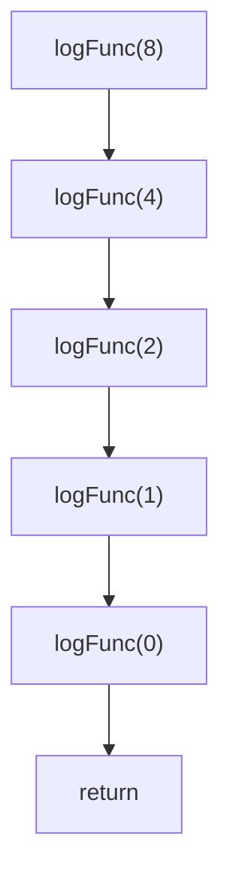
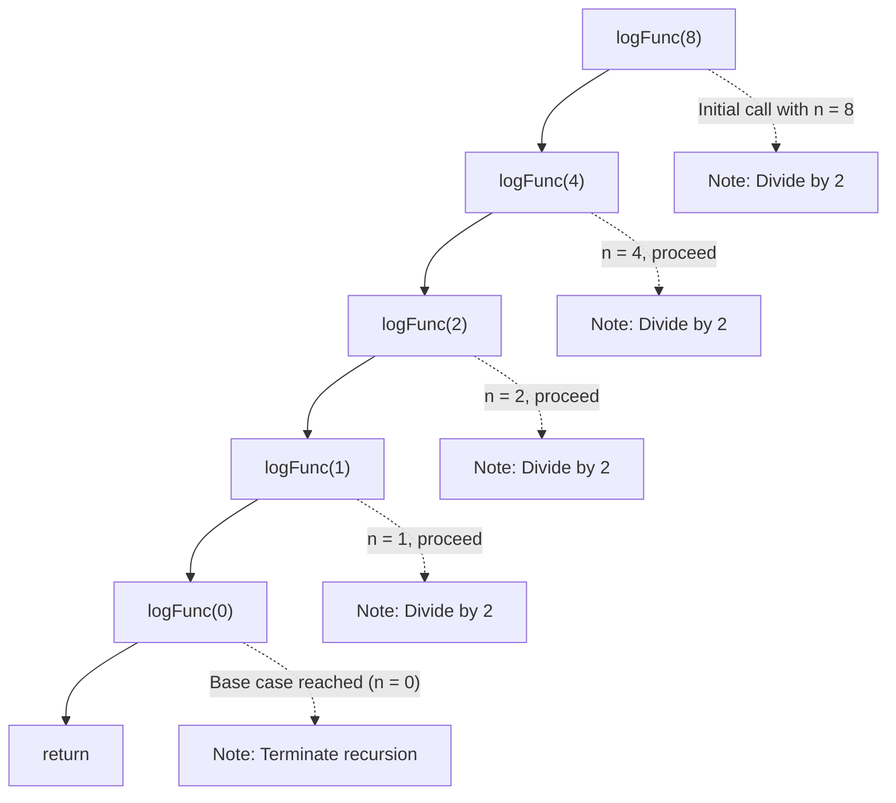
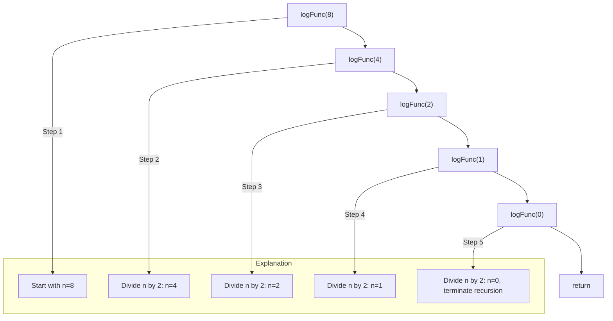
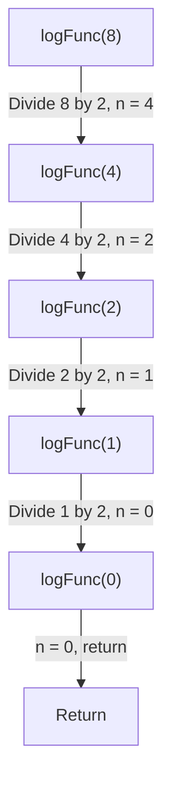

# Introduction to Big-O Notation

Welcome in this introduction to Big-O Notation. I decided to write it to better understand this algorithms analysis method, motivated by the desire to prepare myself for Big Tech coding interviews.

## Table of contents

1. [Overview](#overview)
	1. [Definition](#definition)
	2. [Types of measurement](#types-of-measurement)
	2. [General rules](#general-rules)
2. [Complexities](#complexities)
3. [Third Example](#third-example)
4. [Fourth Example](#fourth-examplehttpwwwfourthexamplecom)

## I - Overview

### 1. Definition

**Big-O Notation** is a mathematical way to describe how the runtime (or space requirement) of an algorithm grows as the size of the input increases. It focuses on the worst-case scenario and provides an upper bound on the growth rate.

It measures algorithm's efficiency based on four principles:

1. **Complexity in terms of input size (N):** abstract the efficiency of algorithms from the machines they run on.
2. **Machine independent:** don't care about the stats of the machine.
3. **Basic computer steps:** only examine the basic computer steps of the code.
4. **Time and space:** analyze time and space.

### 2. Types of measurement

In asymptotic analysis, there are three different ways to estimate the efficiency of an algorithm:

1. **Worst Case Analysis (Mostly used):**
	- In the worst-case analysis, we calculate the upper bound on the running time of an algorithm. We must know the case that causes a maximum number of operations to be executed.
	- This is the most commonly used analysis of algorithms, most of the time we consider the case that causes maximum operations.
	- The Big-O Notation is based on it.
2. **Best Case Analysis (Very Rarely used):**
	- In the best-case analysis, we calculate the lower bound on the running time of an algorithm. We must know the case that causes a minimum number of operations to be executed.
3. **Average Case Analysis (Rarely used):**
	- In average case analysis, we take all possible inputs and calculate the computing time for all of the inputs. Sum all the calculated values and divide the sum by the total number of inputs.
	- We must know (or predict) the distribution of cases.

### 3. General rules

1. **Ignore constants:** for example, if an algorithm has a real compexity of $5 \times O(n)$ so $5n$, we ignore constants so its Big-O Notation will be $O(n)$. Why? Because as a function's input moves towards the infinity, constants become less and less significant.
2. **Certain terms dominate others:** it is called *"Big-O Growth Rate"* or *"Big-O Growth Hierarchy"*. Big-O Notation ignore low-oder terms so the following rule can be deduced:

<div style="text-align: center">

$O(1) < O(log \space n) < O(n) < O(n \space log \space n) < O(n^2) < O(2^n) < O(n!)$

</div>

Here is a graphic representation to better understand this concept:


## II - Complexities

### 1. $O(1)$ - Constant Time

**$O(1)$ complexity** (constant time complexity) describes an algorithm whose execution time or space requirements remain constant regardless of the input size. This means that the algorithm performs the same number of operations, regardless of whether the input size is 1, 100, or 1 million.

<u>**Characteristics:**</u>

- **Independent from input size (N):** the number of steps the algorithm takes does not grow with the size of the input.
- **Efficient:** algorithms with $O(1)$ complexity are typically very fast because they perform a fixed number of operations.
- **Examples:**
	- Expressions that never change (e.g., $100 \times 100000$).
	- Accessing an element in an array by its index (e.g., `arr[5]`).
	- Inserting an element into a hash table (on average).
	- Checking the length of a list (if it is pre-computed)

<u>**Example:**</u>

```Python
x = 5 + (15 * 20);
y = 15 - 2;
print(x + y);
```

In this example, each line of this code has a complexity of $O(1)$ so the complexity of the code is:

<div style="text-align: center">

$O(1) + O(1) + O(1) = O(1)$
$OR$
$3 \times O(1) = O(1)$

</div>

We categorize a function to $O(1)$ if and only if all the steps have a complexity of $O(1)$.

### 2. $O(log \space n)$ - Logarithmic Time

**$O(log \space n)$ complexity** (logarithmic time complexity) describes an algorithm where the execution time grows logarithmically with the size of the input. This means that as the input size increases, the number of operations grows much more slowly, proportional to the logarithm of the input size.

<u>**Characteristics:**</u>

- **Logarithmic Growth:** for each doubling of the input size, the number of operations increases by a fixed, smaller amount.
- **Efficient for Large Inputs:** algorithms with $O(log \space n)$ complexity are very efficient for processing large inputs because the work grows slowly.
- **Common in Divide-and-Conquer:** algorithms that repeatedly divide the input into smaller parts often have $O(log \space n)$ complexity.
- **Examples:**
	- Binary Search: searching for a value in a sorted array by repeatedly halving the search space.
	- Tree Traversals: operations on balanced binary search trees (e.g., insert, delete, or search).

---

Before going further, we need to understand what a logarithm is. Simply, it's the power that a number needs to be raised to get some other number. In computer science, unless specified otherwise, the number that we want to raise to some power is always 2 (binary systems). This the theory, now let's see that more in details thanks to an example.

Considering this expression: $2^x = 8$, we want to find the number to which we must raise 2 to find 8. This expression is the equivalent to: $x = log_2(8) = 3$ so $2^3 = 8$. Here it is, this is the basics of logarithms. Now, we can see codes examples.

<u>**Example (recursive):**</u>

```Python
function logFunc(n) {
	if (n === 0) return;
	n = Math.floor(n / 2);
	return logFunc(n);
}
```








